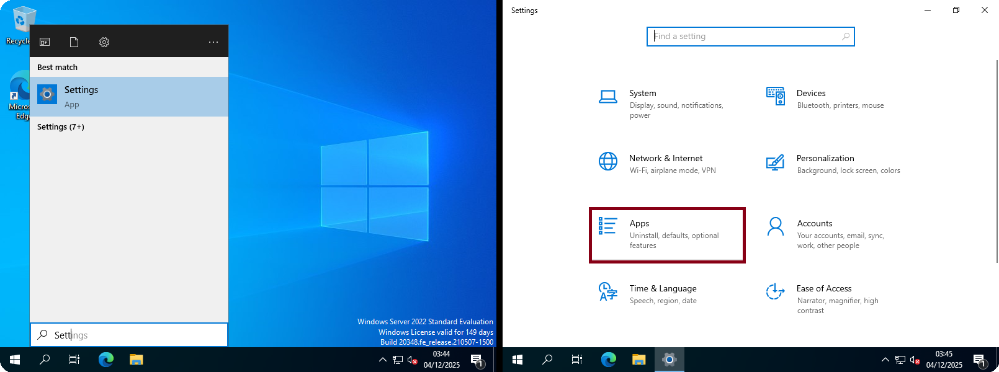
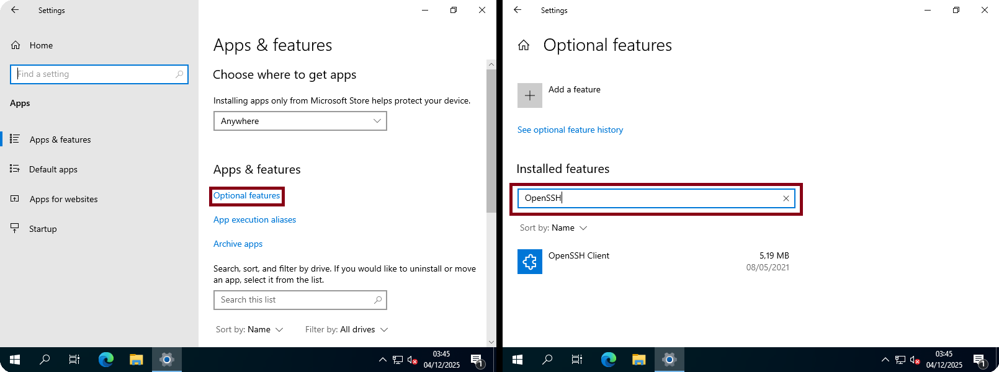
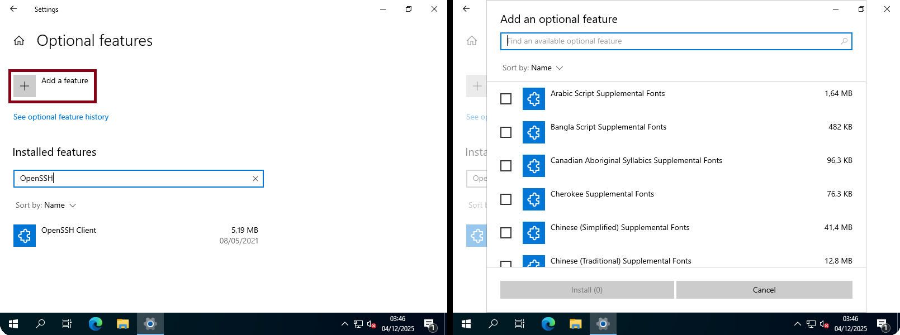
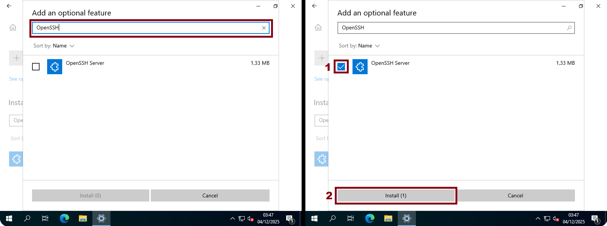
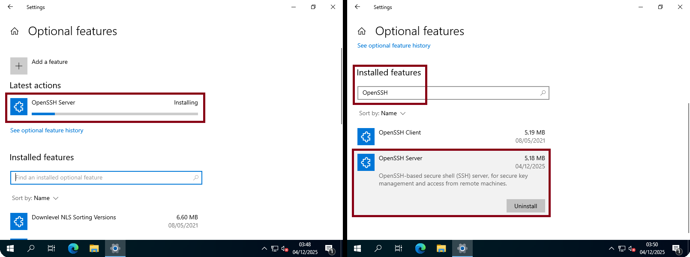

# Documentation d’Installation – Service SSH

## 📋 Table des Matières
 
### A) [Prérequis Techniques](#-prérequis-techniques) 
 
### B) [Installation SSH sur Windows Server 2022](#-installation-ssh-sur-windows-server-2022) 

### C) [Installation sur Debian 13.1](#-installation-sur-debian-131-serveur)  

### D) [Installation sur Ubuntu 24.04 (Client)](#V-installation-sur-ubuntu-2404-client)  

### E) [Installation sur Windows 11 (Client)](#IV-installation-sur-windows-11-client)  

---

## 🔩 Prérequis Techniques

- Un environnement réseau local opérationnel.

- Des postes Windows et/ou Linux intégrés au même réseau.

- Un compte disposant des droits administrateur sur les machines à gérer.

- L’accès au réseau nécessaire pour l’administration à distance (ports, services et pare-feu ouverts).

- Une connexion stable vers les machines cibles pour assurer la communication entre les composants.

---

### 👔 Contexte du Projet 

Dans le cadre de la mise en place d’une solution d’administration centralisée, la configuration de SSH sur quatre machines permet d’établir un accès distant sécurisé entre les différents systèmes. 
Deux de ces machines joueront un rôle de postes de contrôle (SRVWIN01) & (SRVLX01), tandis que les deux autres serviront de machines administrées (CLILIN01) & (CLIWIN01). 

Grâce à SSH, les postes de contrôle pourront exécuter des commandes à distance, transférer des fichiers de manière sécurisée, surveiller l’activité des machines administrées et automatiser certaines tâches d’administration. 
Cette configuration assure une gestion plus efficace, sécurisée et centralisée de l’infrastructure.

---

# Installation SSH sur Windows Server 2022

---

### Etape 1

- Ouvrez le menu Démarrer et tapez : "Settings".

- Cliquez sur l'onglet "Apps".

---

### Etape 2 

- Dans "Apps & features", cliquez sur "Optional features".

- Cette section présente toutes les applications et fonctionnalités installées sur la machine, en tapant "OpenSSH", seul OpenSSH Client sera affiché.

### Etape 3

- Cliquez sur "Add a feature".

- Cette section permet d'installer les applications et fonctionnalité qu'il nous faut.

### Etape 4

- Tapez "OpenSSH".

- Sélectionnez "OpenSSH Server", puis cliquez sur "Install".

### Etape 5 

- Patientez pendant que l’installation de "OpenSSH Server" se termine.

- Tapez "OpenSSH" pour vérifier si le service "OpenSSH Server" est présent sur votre machine.

