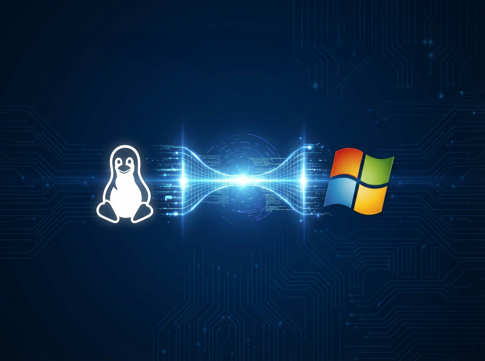

---

## Sommaire 

- [🎯 Présentation du projet](#presentation-du-projet)
- [📜 Introduction](#introduction)
- [👥 Membres du groupe par sprint](#membres-du-groupe-par-sprint)
- [⚙️ Choix Techniques](#choix-techniques)
- [🧗Difficultés rencontrées](#difficultes-rencontrees)
- [💡 Solutions trouvées](#solutions-trouvees)
- [🚀 Améliorations possibles](#ameliorations-possibles)

# 🖥️ ADMINISTRATION DE CLIENTS A DISTANCE

# 🎯 Présentation du projet

## Présentation

Ce projet vise à développer une solution d'administration réseau centralisée et automatisée. Le script doit réaliser une cartographie dynamique du réseau local. L'objectif est de fournir un outil unique permettant aux utilisateurs de se connecter de manière fluide et sécurisée à toutes les machines détectées pour y exécuter des tâches à distance. Dans un environnement professionnel, la gestion d'un parc informatique hétérogène (Windows et Linux) représente un défi majeur pour les administrateurs système. La multiplicité des outils, des protocoles de connexion et des interfaces d'administration engendre une perte de temps significative et augmente le risque d'erreurs humaines.

## Détail de la tâche principale : Scan Réseau et Interopérabilité

La tâche principale du projet est de scanner l’ensemble du sous-réseau 172.16.20.0/24 afin de repérer les hôtes actifs. Une fois une machine identifiée, le script doit déterminer comment communiquer avec elle selon son système :

Machines Windows : Connexion via SSH pour pour lancer des commandes d’administration à distance.

Machines Linux (Debian/Ubuntu) : Connexion via SSH pour lancer des commandes d’administration à distance.

Cette étape permet de rendre toutes les machines du réseau accessibles par un mécanisme unique.

## Détail de la tâche principale (suite) : Exécution de Tâches Administratives à Distance

La suite de la tâche consiste à fournir une série d’outils pour administrer les machines à distance une fois la connexion établie.
Ces actions peuvent inclure :

**Gestion de la sécurité** : Activation pare-feu, Etat des ports, RAM totale/utilisation-en-cours.

**Gestion des comptes** : désactivation d'un compte utilisateur local, vérification d'appartenance groupe, ajout à un groupe /admin, droits/permissions d'utilisateur sur un dossier.

**Gestion du réseau** : Vérifier l’adresse IP-masque-passerelle, lister les interfaces réseau, vérifier les ports ouverts, tester la prise en main à distance (CLI), exécution d’un script à distance via WinRM / SSH

**Gestion du stockage** : Création de répertoire, Suppression de répertoire, /log événement utilisateur, Recherche d'événements pour un ordinateur dans log_evt.log

**Gestion des applications et services** : Liste des applications/paquets installés, liste des services en cours d'exécution.

**Gestion du système et configuration OS** : Redémarrage du système, Vérification de la version de l’OS, Vérification de la marque et du modèle de la machine, Vérification de l’UAC (Windows) activée, Recherche des mises à jour critiques manquantes.

# 📜 Introduction

### Problématique
Comment centraliser et simplifier l'administration de machines aux systèmes d'exploitation différents, tout en garantissant une gestion sécurisée et efficace des tâches courantes ?

### Notre Solution
Ce projet propose un script d'administration unifié capable de :

- Découvrir automatiquement les machines actives sur le réseau local
- Identifier le système d'exploitation de chaque hôte détecté
- Établir une connexion sécurisée via SSH (Linux/Windows)
- Éxécuter des tâches d'administration de manière standardisée, quel que soit l'OS cible

### Périmètre du Projet

| Élément      |	Description    |
| :----------: | :-------------: |
| Réseau cible |	172.16.20.0/24 |
| Systèmes supportés |	Windows 11, Windows Server 2022, Ubuntu 24 , Debian 13 |
| Protocole de connexion |	SSH |
| Type d'interface |	CLI (ligne de commande) |

## 👥 Membres du groupe par sprint

### Sprint 1

|  Membre                 |    Rôle    | Missions                            |
| :---------------------: | :--------: | :---------------------------------: |
| Anis BOUTALEB           |     SM     | Création du tableau Trello, Mise en place structuration Script, Doc Github         |
| Frederick FLAVIL        |     PO     | Structuration du script, Mise en place d'une structuration Script, Doc Github      |
|  Eros-Nathan RIGUIDEL   | Technicien | Installation des pré-requis, Mise en place d'une structuration Script, Doc Github  |

### Sprint 2

|  Membre                 |    Rôle    | Missions                            |
| :---------------------: | :--------: | :---------------------------------: |
| Anis BOUTALEB           | Techicien  | Créations fonctions (Tâches) (.sh)  |
| Frederick FLAVIL        |     SM     | Pseudo-Code, Documentation Github   |
|  Eros-Nathan RIGUIDEL   |     PO     | Création Script (.sh)               |

### Sprint 3

|  Membre                 |    Rôle    | Missions                            |
| :---------------------: | :--------: | :---------------------------------: |
| Anis BOUTALEB           |     PO     | Créations fonctions (Tâches) (.ps1) |
| Frederick FLAVIL        | Technicien | Pseudo-Code, Documentation Github   |
|  Eros-Nathan RIGUIDEL   |     SM     | Documentation Github, Création Script (.ps1) |

### Sprint 4

|  Membre                 |    Rôle    | Missions                            |
| :---------------------: | :--------: | :---------------------------------: |
| Anis BOUTALEB           |     SM     | Création du tableau Trello,         |
| Frederick FLAVIL        |     PO     | Structuration du script             |
|  Eros-Nathan RIGUIDEL   | Technicien | Installation des pré-requis         |

## ⚙️ Choix techniques

## Configuration Réseau des VM: 

- Plage IP du Réseau : 172.16.20.0/24
- Passerelle (GateWay) : 172.16.20.254
- Masque de Sous-réseau : 255.255.255.0
- DNS : 8.8.8.8

## Configuration PROXMOX : 

Nos machines sont les machines **220** à **227**.

## Configuration Réseau des VM: 

## **Matériels Serveurs**

**Serveur Debian :**
- Nom : **SRVLX01**
- OS : **Debian 13.1.0 CLI**
- Langue : US
- Compte utilisateur :  **Root** / **wilder (groupe sudo)**
- Mot de passe : **Azerty1***
- IP : **172.16.20.10**
- Masque : **255.255.255.0**
- DNS : 8.8.8.8

**Serveur Windows :**
  - Nom : **SRVWIN01**
  - OS : **Windows server 2022**
  - Compte utilisateur :  **Administrator** / **Wilder (groupe admin)**
  - Mot de passe : **Azerty1***
  - IP & Masque : **172.16.20.5**
  - Masque : **255.255.255.0**
  - DNS : 8.8.8.8

## **Matériels Clients**

**Client Ubuntu :**
- Nom : **CLINLIN01**
- OS : **Ubuntu 24.04 LTS**
- Compte utilisateur : **wilder (groupe sudo)**
- Langue : FR
- Mot de passe : **Azerty1***
- IP : **172.16.20.30**
- Masque : **255.255.255.0**
- DNS : 8.8.8.8

**Client Windows :**
- Nom : **CLINWIN01**
- OS : **Windows 11**
- Langue : FR
- Compte utilisateur : **Wilder (groupe admin local)**
- Mot de passe : **Azerty1***
- IP : **172.16.20.20**
- Masque : **255.255.255.0**
- DNS : 8.8.8.8

## 🧗 Difficultés rencontrées

## 💡 Solutions trouvées

## 🚀 Améliorations possibles

